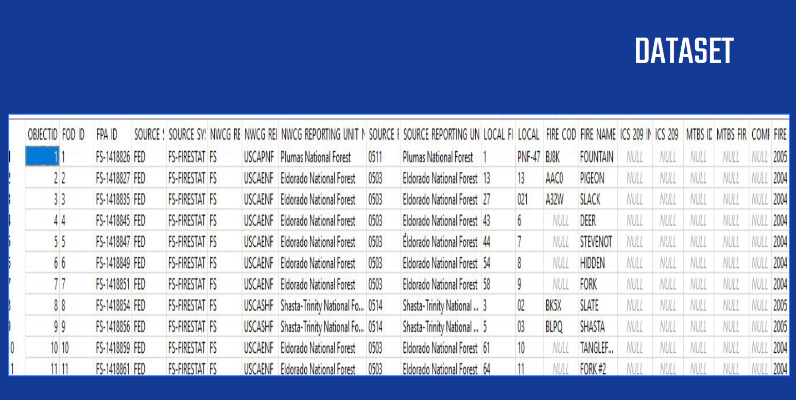
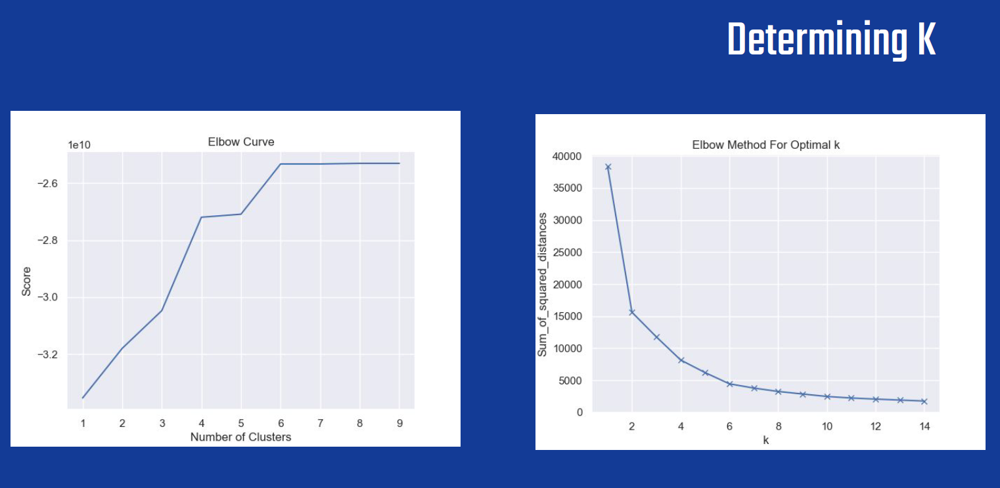
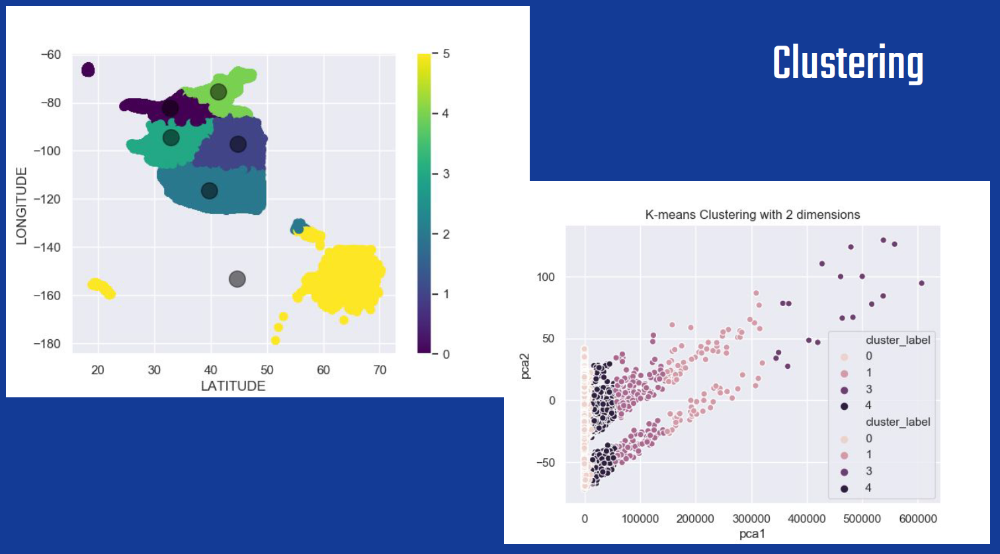

# SOEN 691/499: PROJECT REPORT
- - - -
# Category - Dataset analysis
# Dataset: USA WildFires [https://www.kaggle.com/rtatman/188-million-us-wildfires]

# Team Details:

|   Name  |          Student Id         | 
|:------------------:|:---------------------------------:|
| Yogesh Nimbhorkar        | 40093384            |
| Darshan Dhananjay | 40079241          |
| Sourabh Rajeev Badagandi | 40098471 | 
| Arvind Korchibettu Adiga | 40105178                |

- - - -

## Abstract
In today’s world, wildfires have become one of the most serious natural calamities affecting millions of people worldwide every year. The ability to predict these disasters would not only help in curbing the impact but also give us a chance to improvise the prediction techniques. In this project, we will be aiming to analyze the data using Apache Spark and scikit-learn library on US wildfires applying different techniques on the dataset and predicting the outcome such as classifying the regions from most affected to the least affected. Secondly in determining how predictable the wildfires are concerning factors such as size and location, also visualization of the data and the factors impacting the outcome to understand the behavior of these natural occurrences. By implementing this project we hope to learn the process of using Big Data and Machine learning techniques.
 
## 1. INTRODUCTION
## a. Context ##
Our project deals with the ability to predict the occurrence of wildfires based on its asscociated attributes. The data that we will be using has been provided by the US Government. The wildfire records were acquired from the reporting systems of federal, state, and local fire organizations, the core data elements of the records being discovery date, final fire size, and a point location. Data transformation has been applied so that it conforms to the data standards of the National Wildfire Coordinating Group (NWCG). Basic error-checking was performed to remove redundant records. The filtered data set  includes 1.88 million geo-referenced wildfire records, representing a total of 140 million acres burned during the 24-year period.

## b. Objectives ##
 * Prediction of wildfire size based on its attributes.
 * To identify what regions are the most and least prone to wildfires by using clustering.
 * Given the size, location and date, predicting the cause of a fire wildfire.
 
## c. Presentation of the problem to solve
We selected the dataset which contained different categorical columns, few of which had to be filtered to meet our requirements. These columns could be predicted, on the basis of which classifications could be made later. Correlation between the features and considering which features to select based on the correlation value is to be made for data analysis. Next is the selection of an algorithm to create a set of decision trees for classification and clustering to make accurate predictions and arrive upon our results.
 
## d. Related Work
 * Analysis of Machine Learning Methods for Wildfire Security Monitoring with an Unmanned Aerial Vehicles
 * Machine learning to predict final fire size at the time of ignition-International Journal of Wildland    Fire(https://www.publish.csiro.au/WF/WF19023)-Dmitriy Alexandrov, Elizaveta Pertseva, Ivan Berman, Igor Pantiukhin, Aleksandr Kapitonov 
 * Data-driven Forest Fire analysis, Jerry Gao, Kshama Shalini, Navit Gaur, Xuan Guan

## 2. MATERIALS AND METHODS
## a. The Dataset ##
Fire occurrence database 4th edition represents the occurrence of wildfires in the United States from 1992 to 2015. This is the third update of a publication originally generated to support the national Fire Program Analysis (FPA) system. The wildfire records were acquired from the reporting systems of federal, state, and local fire organizations. The following core data elements were required for records to be included in this data publication: discovery date, final fire size, and a point location at least as precise as Public Land Survey System (PLSS) section (1-square mile grid). The data were transformed to conform, when possible, to the data standards of the National Wildfire Coordinating Group (NWCG). Basic error-checking was performed and redundant records were identified and removed, to the degree possible. The resulting product, referred to as the Fire Program Analysis fire-occurrence database (FPA FOD), includes 1.88 million geo-referenced wildfire records, representing a total of 140 million acres burned during the 24-year period.

Some of the important tables, columns and their significance is explained below:

* Fires: Table including wildfire data for the period of 1992-2015 compiled from US federal, state, and local reporting systems.
* FIRE_CODE = Code used within the interagency wildland fire community to track and compile cost information for emergency fire      suppression (https://www.firecode.gov/).
* FIRE_NAME = Name of the incident, from the fire report (primary) or ICS-209 report (secondary).
* FIRE_YEAR = Calendar year in which the fire was discovered or confirmed to exist.
* DISCOVERY_DATE = Date on which the fire was discovered or confirmed to exist.
* DISCOVERY_DOY = Day of year on which the fire was discovered or confirmed to exist.
* DISCOVERY_TIME = Time of day that the fire was discovered or confirmed to exist.
* STAT_CAUSE_DESCR = Description of the (statistical) cause of the fire.
* FIRE_SIZE = Estimate of acres within the final perimeter of the fire.
* LATITUDE = Latitude (NAD83) for point location of the fire (decimal degrees).
* LONGITUDE = Longitude (NAD83) for point location of the fire (decimal degrees).
* STATE = Two-letter alphabetic code for the state in which the fire burned (or originated), based on the nominal designation in the fire report.
* COUNTY = County, or equivalent, in which the fire burned (or originated), based on nominal designation in the fire report.
* GeographicArea = Two-letter code for the geographic area in which the unit is located 
* Country = Country in which the unit is located (e.g. US = United States).
* State = Two-letter code for the state in which the unit is located (or primarily affiliated).

The dataset is being taken from kaggle which is mostly cleaned data . The dataset may be containing some missing values that need to be preprocessed. The dataset consists of features which need  some filtering based upon the correlation of the features with the result value. We are looking for one more dataset that can be included which is from the UCI repository which has information regarding meteorological data that will help to get more insights and information.

## b. Technologies and Algorithms ##
We have used Spark and scikit learn primarily for dataset analysis. Using this, we analyzed the attributes in the given dataset to come upon a basis to predict size of a wildfire, its containment period and the regions of impact . We then performed visualization using matplotlib to generate heat maps of affected regions. These correlations were obtained using Pearson method.

We then used Kmeans for clustering and random forest algorithms to classify and process the data, thus making accurate predictions and handling missing values. 

## 3. RESULTS
For the classification perspective, the dataset had different categorical columns that could be predicted. Looking at the dataset understanding which columns can be considered as the target variable or the label was a primary task. First step in the data analyis was to check the correlation between the variables or the features in the dataset. Getting the correlation data and considering which features to consider based upon the correlation value.

There were 4-5 features which had a good relation between them. Latitude, Longitude, FIRE_SIZE, STAT_CAUSE_CODE and Duration in these the duration was calucated based upon the difference between containment day and the discovery day. Random Forest was chosen for this as we have multiple categroies or classes in the labels the decision tree algorithm was providing a bad accuracy compared to RF. By using Random Forest the accuracy increased. Still the accuracy of the system can be increased by looking deep into differnet techniques and also reducing the data imbalance. With the current implementation we were able to achieve a accuracy of 78% by taking into the default amount of trees in Random Forest. 

Using the above mentioned tools and algorithms, we are able to obtain the following results :
* Prediction of size of a wildfire.
* Identification of highly prone to least prone areas using heat maps generated by using clustering.
* Prediction of wildfire cause based on its parameters.

Some of the results are shown below :

## 4. DISCUSSION
The solution is relevant to the problem as this explains about the the prediction techniques to find out occurrance of wildfire with respect to the other features, by using this solution the wildfires could be avoided in the future. This would help people who are living in the surrounding regions to become cautious and take preventive measures that can reduce the damage.The solution also has many other advantages and can be applied to various natural disasters, which have similar statistics.

There were couple of limitations that we encountered in the project as starting from the dataset, feature selection, correlation issues in the dataset and the unbalanced data. In-spite of huge dataset the values in the features were not so informative and had many null values which decreased the dataset count from the initial. Apart from the dataset the correlation between the features were not high due to which new columns were being generated by using the existing column to get a good prediction such as Duration was calculated based upon the two features column discovery day and containment day and finally there was a huge unbalanced class label data, as a result under sampling was performed in some of the classes and as a result the data points reduced down further for training which impacted the prediction accuracy.

This project in the future can be extended further by including more fields that are relevant such as climatic conditions and various other geographic data which will help to increase the prediction accuracy of the model. Advanced machine learning algorithms can be applied such as neural network and deep learning to enhance the accuracy. The concept can be applied to many other natural calamities that are occurring in many parts of the world that are costing both environmental and economic damage, this prediction can also be extended to the decide where to build the city infrastructure and farming activities. 

 
